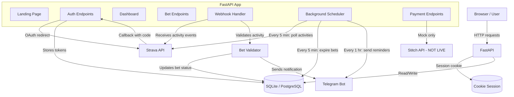
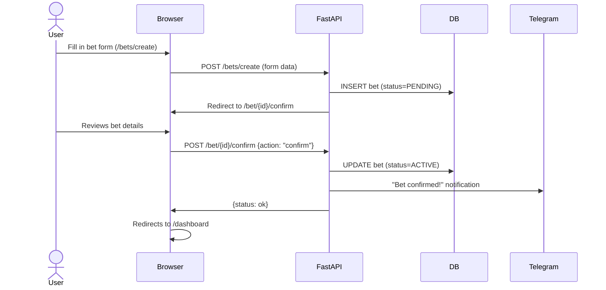
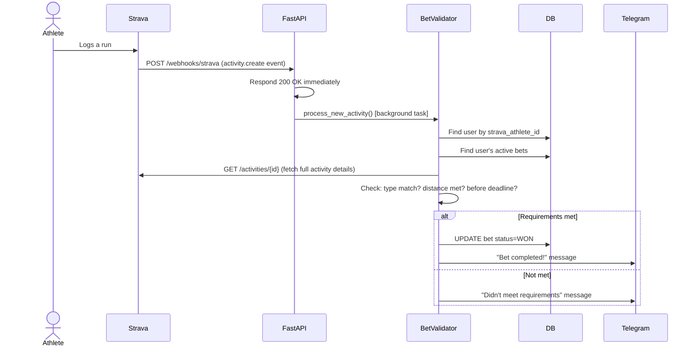
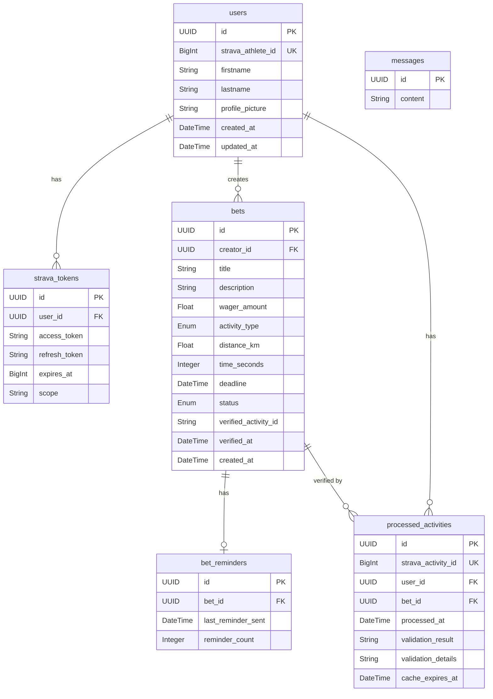

# SweatBet — Architecture Document

> Written for a smart non-engineer who built it but wants to understand what they have.

---

## 1. What Is This Product?

SweatBet is a fitness accountability app. You connect your Strava account, create a bet (e.g. "I'll run 5km before Friday or lose R100"), and the app automatically monitors your Strava activities. If you complete the workout in time, you win — your money stays in your pocket. If you miss it, you lose your stake.

The app is currently single-player (you bet against yourself). The vision includes 1v1 challenges and group pools, but neither is built yet.

**Current reality:** It's a working demo. One real user (you), running locally or on Railway, with Telegram notifications and mock payments. Nothing is connected to real money yet.

---

## 2. Repository Map

```
SweatBet/
├── backend/                    # All server-side Python code
│   ├── fastapi/
│   │   ├── main.py             # App entry point — boots FastAPI, mounts templates/static, wires everything
│   │   ├── core/
│   │   │   ├── config.py       # Settings classes (dev vs prod), reads .env file
│   │   │   ├── init_settings.py # Parses --mode CLI arg, creates global settings object
│   │   │   ├── lifespan.py     # Startup/shutdown hooks: init DB, seed messages, start scheduler
│   │   │   ├── middleware.py   # CORS, session cookie, /docs auth protection
│   │   │   ├── routers.py      # Registers all URL route modules with the app
│   │   │   └── constants.py    # Empty file (placeholder)
│   │   ├── api/v1/endpoints/   # One file per feature area, each is a self-contained router
│   │   │   ├── landing.py      # GET / — landing page, redirects if logged in
│   │   │   ├── auth.py         # GET /auth/strava, /auth/callback, /auth/logout, /auth/demo-login
│   │   │   ├── dashboard.py    # GET /dashboard — shows activities + active bets
│   │   │   ├── bet.py          # GET/POST /bets/create, GET /bets, POST /bets/{id}/cancel
│   │   │   ├── bet_confirm.py  # GET/POST /bet/{id}/confirm — review and activate a new bet
│   │   │   ├── payment.py      # Payment checkout, return, wallet, bank account, withdrawals
│   │   │   ├── webhook.py      # GET/POST /webhooks/strava — receives activity events from Strava
│   │   │   ├── settings.py     # GET /settings, data export, disconnect Strava, delete account
│   │   │   ├── health.py       # GET /health — Railway health check, tests DB connection
│   │   │   ├── legal.py        # Privacy policy and Terms of Service pages
│   │   │   ├── message.py      # Legacy template leftover — CRUD for Message model
│   │   │   ├── doc.py          # Likely legacy — serves old documentation page
│   │   │   └── base.py         # Likely legacy — base route from starter template
│   │   ├── models/             # Database table definitions (SQLAlchemy ORM)
│   │   │   ├── user.py         # User + StravaToken tables
│   │   │   ├── bet.py          # Bet table with status and activity type enums
│   │   │   ├── bet_reminder.py # Tracks when reminders were last sent (cooldown)
│   │   │   ├── processed_activity.py # Strava activities already checked (prevents duplicates)
│   │   │   └── message.py      # Legacy starter template model — not used meaningfully
│   │   ├── schemas/            # Pydantic validation shapes (what data looks like in/out of API)
│   │   │   ├── bet.py          # BetCreate, BetRead, BetSummary, BetStatus enum
│   │   │   ├── user.py         # UserCreate, UserRead, StravaTokenRead, StravaActivity
│   │   │   └── message.py      # Legacy
│   │   ├── services/           # Business logic that does the actual work
│   │   │   ├── strava.py       # StravaClient: OAuth URLs, token exchange/refresh, fetch activities
│   │   │   ├── bet_validator.py # Checks if a Strava activity meets a bet's requirements
│   │   │   ├── activity_scheduler.py # Background jobs: check activities, expire bets, send reminders
│   │   │   ├── telegram.py     # Sends Telegram messages for all events (bet won/lost/expired/etc)
│   │   │   └── stitch.py       # Stitch payment client — MOCK ONLY, production raises NotImplementedError
│   │   ├── dependencies/
│   │   │   ├── database.py     # DB engine setup, session factories, get_sync_db/get_async_db
│   │   │   ├── auth.py         # get_current_user() and require_auth() — reads user from session
│   │   │   └── rate_limiter.py # Dead code — imports fastapi_limiter/aioredis which aren't installed
│   │   └── crud/
│   │       └── message.py      # Async DB insert for Message — called during startup (legacy)
│   ├── data/
│   │   └── init_data.py        # Seeds two "test content" Message rows on every startup (legacy noise)
│   └── security/
│       ├── authentication.py   # authenticate_user() checks username/password from env — NOT USED anywhere
│       └── authorization.py    # Empty file
│
├── frontend/
│   ├── sweatbet/
│   │   ├── templates/          # Jinja2 HTML templates rendered server-side
│   │   │   ├── base.html       # Layout wrapper with nav, dark theme CSS
│   │   │   ├── landing.html    # Homepage with Strava connect button
│   │   │   ├── dashboard.html  # Post-login: recent activities + active bets
│   │   │   ├── bet_create.html # Form: activity type, distance, deadline, wager amount
│   │   │   ├── bet_confirm.html # Review page after creation: confirm or decline a bet
│   │   │   ├── bets_list.html  # All bets grouped by status (active/completed/cancelled)
│   │   │   ├── payment_checkout.html # Choose payment method (card / bank / wallet)
│   │   │   ├── payment_return.html   # Success/failure page after Stitch redirects back
│   │   │   ├── wallet.html     # Balance, bank account, transaction history (all mock data)
│   │   │   ├── settings.html   # Connected accounts, data export, delete account
│   │   │   ├── privacy.html    # Privacy policy (required for Strava app approval)
│   │   │   └── terms.html      # Terms of service
│   │   └── static/
│   │       ├── style.css       # Main app stylesheet (dark theme, Strava orange #FC5200)
│   │       ├── bet_confirm.css # Styles for confirmation page (confetti, countdown)
│   │       ├── payment.css     # Styles for payment checkout/return pages
│   │       └── powered-by-strava.svg # Required Strava brand asset
│   ├── login/                  # Legacy login UI from starter template — not used
│   │   ├── templates/
│   │   └── static/
│   └── assets/
│       └── favicon.ico
│
├── alembic/                    # Database migration management
│   ├── env.py                  # Connects Alembic to SQLAlchemy models + DATABASE_URL env var
│   ├── script.py.mako          # Template for generating new migration files
│   └── versions/
│       └── c79990a12f4f_initial_schema.py  # Single migration: converts NUMERIC ids to UUID type
│
├── scripts/
│   ├── manage_webhook.py       # CLI tool: view/create/delete/test Strava webhook subscription
│   ├── seed_demo_data.py       # Populates dev.db with a demo user and 3 sample bets
│   └── test_webhook.sh         # Shell script to simulate a Strava webhook POST locally
│
├── StravaDocs/                 # Strava API PDFs saved for reference
├── .env                        # Actual secrets (not committed)
├── .env.example                # Template showing all env vars needed
├── alembic.ini                 # Alembic config pointing to dev.db by default
├── Dockerfile                  # Multi-stage Docker build for Railway deployment
├── railway.toml                # Railway config: health check path, restart policy
├── requirements.txt            # Python dependencies
├── dev.db                      # SQLite database (dev only, committed — bad practice)
├── TODO.md                     # Master checklist for all remaining work
├── SweatBetPRD.md              # Product requirements document
└── DevelopSweatBetWithRailway.md # Setup and deployment guide
```

---

## 3. How the Pieces Connect

### System Overview



### Data Flow: Creating a Bet



### Data Flow: Activity Verification (Webhook Path)



### Data Flow: Scheduler Path (Polling Fallback)

Every 5 minutes, the background scheduler independently fetches recent Strava activities for all users with active bets. This is a fallback/supplement to webhooks — if a webhook is missed, the scheduler will catch it within 5 minutes.

Both paths use the same `validate_activity_for_bet()` function. The `ProcessedActivity` table prevents double-processing.

---

## 4. The Tech Stack

| Layer | Technology | Why It's There |
|-------|-----------|----------------|
| Web framework | **FastAPI** (Python) | Async, fast, Pydantic validation built in |
| Web server | **Uvicorn** | ASGI server that runs FastAPI |
| Templates | **Jinja2** | Server-side HTML rendering — no separate frontend framework |
| Database ORM | **SQLAlchemy** | Maps Python objects to DB tables |
| DB (dev) | **SQLite** (`dev.db`) | Zero-config local database |
| DB (prod) | **PostgreSQL** | Via Railway, configured with `DATABASE_URL` |
| Async DB driver | **aiosqlite** (dev) / **asyncpg** (prod) | SQLAlchemy async sessions |
| Migrations | **Alembic** | Version-controlled schema changes for prod |
| Settings | **pydantic-settings** | Loads `.env` file into typed Python objects |
| Session auth | **Starlette SessionMiddleware** + **itsdangerous** | Encrypted session cookie |
| HTTP client | **httpx** | Async HTTP for calling Strava + Telegram APIs |
| Background jobs | **APScheduler** | Runs activity checks and reminders on a timer |
| External: Auth | **Strava OAuth 2.0** | The only login method (no email/password) |
| External: Notifications | **Telegram Bot API** | Real-time alerts for bet events |
| External: Payments | **Stitch** (stitch.money) | SA payments: cards + Apple Pay — mock only |
| Containerisation | **Docker** | Multi-stage build, deployed to Railway |
| Hosting | **Railway** | PaaS deployment with PostgreSQL add-on |
| Testing | **pytest** | Test files exist but have minimal coverage |

### What's notably absent
- No JavaScript framework — HTML is rendered on the server, with minimal inline JS for form submissions
- No Redis — the rate limiter code references it but it's dead code, nothing uses Redis
- No email/SMS — Telegram only right now (WhatsApp is on the roadmap)
- No real payment processing — the Stitch integration is fully mocked

---

## 5. Entry Points

### Starting the app locally

```
python -m backend.fastapi.main --mode dev
```

Execution sequence:
1. `init_settings.py` — parses `--mode dev`, loads `.env`, creates `DevSettings` object
2. `main.py` — creates the FastAPI app, mounts static files and templates
3. `middleware.py` — attaches CORS, session cookie, and /docs auth protection
4. `routers.py` — registers all 12+ URL routers
5. `lifespan.py` (startup hook):
   - `init_db()` — creates all tables in `dev.db` if they don't exist
   - Seeds two "test content" messages into the DB (legacy noise, does nothing useful)
   - `start_scheduler()` — launches APScheduler with 4 background jobs

### User visits the site for the first time

```
GET /
  → landing.py checks session: no user_id found
  → renders landing.html with the "Connect with Strava" button
```

### User clicks "Connect with Strava"

```
GET /auth/strava
  → generates CSRF state token, stores in session
  → redirects to https://www.strava.com/oauth/authorize?...

GET /auth/callback?code=abc123&state=xyz
  → verifies state matches session (CSRF check)
  → calls Strava token endpoint: code → access_token + athlete data
  → upserts User row in DB (creates if new, updates if existing)
  → creates/updates StravaToken row in DB
  → sets session["user_id"]
  → redirects to /dashboard
```

### User creates a bet

```
GET /bets/create        → renders empty form
POST /bets/create       → validates form, INSERT into bets (status=PENDING)
                        → redirects to /bet/{id}/confirm

GET /bet/{id}/confirm   → renders review page showing bet details
POST /bet/{id}/confirm  → sets status=ACTIVE (or CANCELLED if declined)
                        → sends Telegram notification
```

### Strava sends a webhook event

```
POST /webhooks/strava   → immediately returns 200 OK
                        → background task: process_new_activity()
                          → looks up user by strava_athlete_id
                          → fetches activity details from Strava API
                          → validates against all active bets
                          → updates bet status (WON or stays active)
                          → sends Telegram notification
```

---

## 6. Database Schema



**Bet status lifecycle:**
```
PENDING → ACTIVE (user confirms bet)
ACTIVE  → WON    (Strava activity meets requirements)
ACTIVE  → LOST   (scheduler marks expired bets)
PENDING or ACTIVE → CANCELLED (user cancels)
```

---

## 7. Key Configuration (Environment Variables)

| Variable | Required | Purpose |
|----------|----------|---------|
| `ENV_MODE` | Yes | `dev` or `prod` — controls DB, validation, mock mode |
| `SECRET_KEY` | Prod | Signs session cookies — must be secret and stable |
| `STRAVA_CLIENT_ID` | Yes | Your Strava app's ID |
| `STRAVA_CLIENT_SECRET` | Yes | Your Strava app's secret |
| `STRAVA_REDIRECT_URI` | Yes | Where Strava sends users after OAuth (must match Strava app settings) |
| `STRAVA_WEBHOOK_VERIFY_TOKEN` | Yes | Token to verify Strava is calling your webhook |
| `DATABASE_URL` | Prod | PostgreSQL connection string (Railway injects this automatically) |
| `HOST_URL` | Prod | Your public domain (e.g. `https://sweatbet.railway.app/`) |
| `TELEGRAM_BOT_TOKEN` | Optional | If absent, notifications are silently skipped |
| `TELEGRAM_CHAT_ID` | Optional | Which Telegram chat to send messages to |
| `SCHEDULER_ENABLED` | Optional | Set to `False` to disable background jobs |

---

## 8. Current State & Technical Debt

This is an honest assessment of what's working, what's broken, and what's held together with string.

### What Actually Works
- Strava OAuth login (full flow: redirect → callback → session)
- Bet creation and confirmation flow
- Webhook receiver — Strava can call `/webhooks/strava` and activities get validated
- Background scheduler — polls Strava, expires bets, sends reminders
- Telegram notifications — fires on every meaningful event
- Demo mode — `/auth/demo-login` bypasses Strava for local testing
- Dev database — SQLite auto-creates on first run, no setup needed

### What Is Mocked / Incomplete

**Payments (entirely fake):**
The `payment.py` endpoint and `stitch.py` service look complete from the UI side, but all payment state lives in Python dictionaries in memory (`_mock_wallets`, `_mock_bank_accounts`, `_mock_transactions` in `payment.py`). These are wiped every time the server restarts. The actual Stitch API calls raise `NotImplementedError`. No real money can move anywhere.

**Wallet balance never updates on win:**
When a bet is won, the bet status changes to `WON` but no code credits the user's wallet. The wallet balance is always 0 unless the mock state happens to persist.

**No multi-player:**
The bet confirmation page has a "participants" section and displays "Challenger" roles, but a bet always has exactly one participant (the creator). 1v1 and group bets are not implemented despite the UI implying otherwise.

### Technical Debt

**1. Wallet/payment state resets on restart.**
`_mock_wallets` etc. are module-level dictionaries. Every server restart wipes all payment history. This needs a proper `Wallet` and `Transaction` DB table before any real money flows.

**2. Alembic migration is broken for a fresh database.**
The only migration (`c79990a12f4f`) alters existing columns from NUMERIC to UUID. It assumes the tables already exist. On a brand new PostgreSQL database, this migration will fail because there are no tables to alter. In dev, `Base.metadata.create_all()` creates them directly — but in prod, you'd need to run `create_all` manually before running migrations, or generate a proper "create tables from scratch" migration. This is a deployment blocker.

**3. `asyncpg` is not in requirements.txt.**
The prod async DB URL uses `postgresql+asyncpg://...`. `asyncpg` is the driver for this. It's not listed in `requirements.txt`. Any async DB operation in production would crash with an import error. (Most requests use the sync session, so this may not be immediately noticed, but `create_message_dict_async` is called on startup.)

**4. Enums are duplicated.**
`BetStatus` and `ActivityType` are defined in both `models/bet.py` and `schemas/bet.py`. They're separate Python classes that happen to have the same values. If you add a new activity type to one, you must remember to add it to the other. They should be defined once and imported.

**5. `ProcessedActivity.validation_result` type mismatch.**
The model defines this as `String(50)`. The seed script passes `True` (a Python boolean). This silently works in SQLite but will fail or corrupt data in PostgreSQL with strict typing.

**6. `backend/security/` is dead code.**
`authentication.py` has a username/password checker that reads from env vars. `authorization.py` is an empty file. Neither is imported or used anywhere. This is leftover from the original FastAPI starter template.

**7. `rate_limiter.py` is dead code that would crash if activated.**
It imports `fastapi_limiter` and `aioredis`, neither of which are in `requirements.txt`. If anyone wires this into a route, it will crash on import.

**8. `Message` model and `init_data.py` are legacy noise.**
Every server startup inserts "test content 1" and "test content 2" into the `messages` table. This table does nothing for the product. It's from the FastAPI starter template and was never removed.

**9. `backend/security/authentication.py` mentions username/password login.**
The `config.py` has `USER_NAME` and `PASSWORD` settings. But the app only supports Strava OAuth — there is no username/password login route anywhere.

**10. Demo login button is visible in production HTML.**
`landing.html` hardcodes the demo login button. The `/auth/demo-login` endpoint correctly checks `ENV_MODE != 'dev'` and redirects away, but the button is still visually present on the production landing page, which looks unprofessional and confusing to real users.

**11. `dev.db` is committed to git.**
The SQLite database file (including any test data) is in the repository. It shouldn't be — it's a binary file that changes on every run and can contain personal data.

**12. Dashboard stats are placeholder numbers.**
The landing page shows "87% complete their goals", "R50K+ on the line monthly", "3.2x more consistent training". These are made-up marketing numbers. No data backs them.

**13. Async and sync sessions are both in use inconsistently.**
Most endpoints use `get_sync_db` (synchronous SQLAlchemy sessions). The startup lifespan uses an async session. The bet validator (called from the webhook background task) takes a `Session` — but the background task passes the sync session from the webhook handler, which may already be closed by the time the background task runs. This is a latent bug.

**14. Webhook background task uses the request's DB session.**
In `webhook.py`, the `process_new_activity` background task receives `db: Session` that was created for the request. Background tasks run after the response is sent, at which point the session may be closed. This works by accident in some configurations but is architecturally wrong.

---

## 9. Key Concepts to Understand

To meaningfully work on this codebase, you need to understand these 8 concepts:

### 1. Strava OAuth 2.0 (how login works)
SweatBet has no passwords. The only login is via Strava. Strava's OAuth flow works like this: user clicks "Connect", gets redirected to strava.com where they grant permission, then Strava redirects back to `/auth/callback` with a temporary `code`. The server exchanges that code with Strava for an `access_token` (valid ~6 hours) and a `refresh_token` (long-lived). The access token is what lets the app call the Strava API on the user's behalf. When it expires, the app uses the refresh token to get a new one — this happens automatically in `strava_client.ensure_valid_token()`.

### 2. Strava Webhooks vs. Polling (two ways activities are detected)
When you finish a run and save it on Strava, Strava sends a POST request to your registered webhook URL (`/webhooks/strava`). This is the **push** path — Strava tells you immediately. The **poll** path is the background scheduler, which independently calls the Strava API every 5 minutes to check for recent activities. Both paths end up calling `validate_activity_for_bet()`. The `ProcessedActivity` table ensures each activity is only evaluated once, regardless of which path detects it first.

### 3. Session-based Authentication (how the app knows who you are)
After login, the server stores `user_id` in an encrypted cookie (Starlette's `SessionMiddleware`). On every subsequent request, the server decrypts the cookie and looks up the user in the database. `get_current_user()` in `dependencies/auth.py` does this — it returns `None` if no valid session exists. Most page routes check this and redirect to `/` if unauthenticated.

### 4. SQLAlchemy Sync vs. Async (two database modes)
The app has two database engines: a synchronous one (`SyncSessionLocal`) and an async one (`AsyncSessionLocal`). Most page endpoints use the sync one via `get_sync_db`. The async one is used only in the startup lifespan for the legacy Message seed. In practice, the sync sessions are simpler and what you'll work with most. Don't mix them — a sync session can't be awaited.

### 5. Background Tasks vs. Scheduler (two types of async work)
FastAPI's `BackgroundTasks` runs code after a response is sent, within the same process, attached to a specific request. The scheduler (`APScheduler`) runs independently on a timer, not tied to any request. The webhook uses background tasks for Telegram notifications and activity validation. The scheduler independently polls Strava. Both have access to the database but use different session factories.

### 6. Bet Lifecycle (the state machine)
A bet moves through statuses: `PENDING` → `ACTIVE` → `WON` / `LOST` / `CANCELLED`. PENDING means created but not confirmed. ACTIVE means confirmed and in progress. The scheduler's `check_expired_bets` job moves ACTIVE/PENDING bets to LOST when their deadline passes. The webhook/scheduler moves bets to WON when a qualifying activity is found. Only PENDING and ACTIVE bets can be cancelled.

### 7. Dev Mode vs. Prod Mode (the two-environment switch)
`ENV_MODE=dev` (set in `.env`) activates: SQLite instead of PostgreSQL, auto-table creation instead of Alembic migrations, the demo login bypass, and mock activities on the dashboard. `ENV_MODE=prod` activates: PostgreSQL, the Alembic migration path, validation that all required secrets are set, and real Strava API calls. The Stitch payment client is mocked in both modes — it checks for `STITCH_CLIENT_ID` env var, which doesn't exist yet.

### 8. The Stitch Payment Flow (designed but not live)
The intended payment flow: user creates a bet with a wager → they get redirected to a checkout page → they pick a payment method → the app calls Stitch to create a payment request → Stitch redirects the user to their payment page → after payment, Stitch redirects back to `/payments/return` → the app activates the bet. In mock mode, this entire flow is simulated: Stitch immediately redirects to the return page with `status=complete`. In production, the `create_payment_request()` method raises `NotImplementedError`.

---

## 10. How to Run It

```bash
# One-time setup
python3 -m venv venv
source venv/bin/activate
pip install -r requirements.txt

# Copy and fill in .env
cp .env.example .env
# Set at minimum: STRAVA_CLIENT_ID, STRAVA_CLIENT_SECRET, STRAVA_REDIRECT_URI=http://localhost:5000/auth/callback

# Seed demo data (optional)
python scripts/seed_demo_data.py

# Run the server
python -m backend.fastapi.main --mode dev

# Visit http://localhost:5000
# Demo login (no Strava needed): http://localhost:5000/auth/demo-login
```

---

## 11. Deployment (Railway)

Railway reads `railway.toml` and builds using the `Dockerfile`. The multi-stage Dockerfile:
1. Stage 1 (`builder`): installs Python deps into `/opt/venv`
2. Stage 2 (runtime): copies venv + app code, runs `python -m backend.fastapi.main --mode prod --host 0.0.0.0`

Railway injects `DATABASE_URL`, `PORT`, and other env vars you set in the Railway dashboard. The app reads `PORT` from the environment (defaulting to 5000) for Uvicorn.

**Before deploying:** The Alembic migration needs to be fixed (see Technical Debt #2) so it creates tables on a fresh database. Currently `init_db()` calls `Base.metadata.create_all()` only in dev mode, not in prod.

The webhook subscription must be registered separately using:
```bash
python scripts/manage_webhook.py create
```
This calls the Strava API to register your public URL as the webhook receiver. You can only have one subscription at a time.
