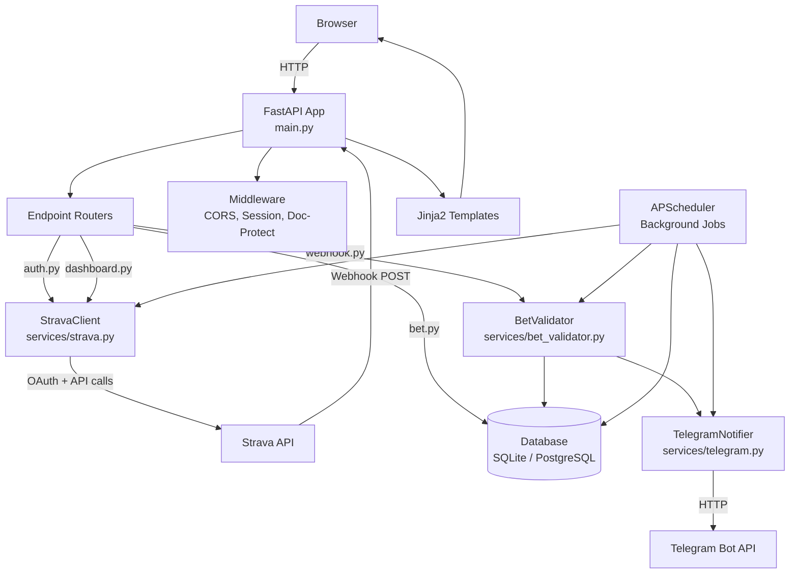

# SweatBet Architecture

## 1. What This Product Does

SweatBet is a fitness motivation app. You connect your Strava account, create a bet ("I'll run 5km by Friday or I lose $100"), and the app automatically checks your Strava activities to see if you did it. If you complete the activity before the deadline, you win. If you don't, you lose.

The core loop: **Set a goal -> Put money on it -> Exercise -> App verifies via Strava -> Win or lose.**

Right now, SweatBet only supports solo bets (you vs. yourself). The wager amounts are tracked but no real money changes hands -- there is no payment system. Notifications go to a Telegram chat, not to individual users.

Target market: South African Strava users (runners, cyclists). The currency references are ZAR (South African Rand) in the PRD but $ in the UI.

---

## 2. Repository Map

```
sweatbet/
├── ARCHITECTURE.md              # This file
├── SweatBetPRD.md               # Product requirements document (the vision)
├── DevelopSweatBetWithRailway.md # Dev guide written for junior developers
├── Dockerfile                   # Multi-stage Docker build (Python 3.12)
├── railway.toml                 # Railway PaaS deployment config
├── requirements.txt             # Python dependencies (17 packages)
├── .env                         # Environment variables (gitignored but present on disk)
├── .gitignore                   # Standard Python gitignore
├── .dockerignore                # Excludes docs, tests, dev files from Docker image
├── .railwayignore               # Excludes docs, tests from Railway builds
├── dev.db                       # SQLite database (local dev, gitignored but present)
│
├── backend/                     # All server-side Python code
│   ├── __init__.py
│   ├── data/
│   │   └── init_data.py         # Seed data: 2 dummy Message records inserted on every startup
│   │
│   ├── fastapi/                 # The FastAPI application
│   │   ├── main.py              # ** Entry point ** - creates app, mounts static files, wires everything
│   │   │
│   │   ├── api/v1/endpoints/    # Route handlers (the "controllers")
│   │   │   ├── auth.py          # Strava OAuth flow + demo login
│   │   │   ├── dashboard.py     # Dashboard page (activities + active bets)
│   │   │   ├── landing.py       # Landing/home page
│   │   │   ├── bet.py           # Create bet, list bets, cancel bet + JSON API endpoints
│   │   │   ├── webhook.py       # Strava webhook receiver (verification + event handling)
│   │   │   ├── settings.py      # User settings, data export, account deletion
│   │   │   ├── legal.py         # Privacy policy + terms of service pages
│   │   │   ├── doc.py           # Login gate for /docs (API documentation)
│   │   │   ├── base.py          # Single "/" endpoint returning JSON (orphaned, overridden by landing)
│   │   │   └── message.py       # CRUD API for Message model (leftover from template)
│   │   │
│   │   ├── core/                # App configuration and wiring
│   │   │   ├── config.py        # Settings classes (DevSettings, ProdSettings) using pydantic-settings
│   │   │   ├── constants.py     # Empty file
│   │   │   ├── init_settings.py # CLI arg parsing (--mode dev/prod, --host) + settings initialization
│   │   │   ├── lifespan.py      # App startup: init DB, seed data, start scheduler. Shutdown: stop scheduler
│   │   │   ├── middleware.py     # CORS, session middleware, doc-protect middleware
│   │   │   └── routers.py       # Registers all endpoint routers on the app
│   │   │
│   │   ├── crud/
│   │   │   └── message.py       # MessageService class (sync + async CRUD for Message model)
│   │   │
│   │   ├── dependencies/
│   │   │   ├── database.py      # SQLAlchemy engine setup, Base, session factories, init_db()
│   │   │   └── rate_limiter.py  # Rate limiter using Redis (NOT CONNECTED - imports aioredis which isn't installed)
│   │   │
│   │   ├── models/              # SQLAlchemy ORM models
│   │   │   ├── __init__.py      # Re-exports all models
│   │   │   ├── user.py          # User + StravaToken
│   │   │   ├── bet.py           # Bet (with BetStatus, ActivityType enums)
│   │   │   ├── bet_reminder.py  # BetReminder (tracks when reminders were sent)
│   │   │   ├── processed_activity.py  # ProcessedActivity (prevents duplicate Strava activity processing)
│   │   │   └── message.py       # Message (leftover from template)
│   │   │
│   │   ├── schemas/             # Pydantic validation schemas
│   │   │   ├── __init__.py      # Re-exports all schemas
│   │   │   ├── user.py          # User, StravaToken, StravaActivity schemas
│   │   │   ├── bet.py           # Bet CRUD schemas with validation
│   │   │   └── message.py       # Message schemas (leftover)
│   │   │
│   │   └── services/            # Business logic and external integrations
│   │       ├── strava.py        # StravaClient: OAuth, token refresh, activity fetching
│   │       ├── bet_validator.py # Validates Strava activities against bet requirements
│   │       ├── activity_scheduler.py  # APScheduler background jobs (check activities, expire bets, send reminders)
│   │       └── telegram.py      # TelegramNotifier: sends formatted messages to a Telegram chat
│   │
│   ├── security/
│   │   ├── authentication.py    # Simple username/password check against env vars (for /docs access)
│   │   └── authorization.py     # Empty file
│   │
│   └── tests/
│       ├── test_api_sync.py     # Sync CRUD tests for Message endpoints
│       ├── test_api_async.py    # Async CRUD test for Message endpoints
│       └── test_speed.py        # Bulk insert speed comparison (sync vs async)
│
├── frontend/                    # Server-rendered HTML templates + CSS
│   ├── __init__.py
│   ├── assets/
│   │   └── favicon.ico
│   ├── login/                   # Legacy login UI (for /docs access gate)
│   │   ├── static/style.css
│   │   └── templates/
│   │       ├── base.html
│   │       └── login.html
│   └── sweatbet/                # Main SweatBet UI
│       ├── __init__.py
│       ├── static/style.css     # 1160 lines of hand-written CSS (dark theme, responsive)
│       └── templates/
│           ├── base.html        # Nav + footer layout
│           ├── landing.html     # Marketing landing page
│           ├── dashboard.html   # Activity feed + active bets
│           ├── bet_create.html  # Bet creation form
│           ├── bets_list.html   # All bets grouped by status
│           ├── settings.html    # Account settings + data export + delete
│           ├── privacy.html     # Privacy policy (required by Strava)
│           └── terms.html       # Terms of service
│
├── scripts/
│   ├── manage_webhook.py        # CLI tool to create/view/delete Strava webhook subscriptions
│   ├── seed_demo_data.py        # Seeds a demo user + 3 bets (active, won, lost)
│   └── test_webhook.sh          # curl script to simulate a Strava webhook POST
│
└── StravaDocs/                  # PDF reference docs (not deployed)
    ├── Strava Developers_1.pdf
    ├── Strava Developers_API Ref.pdf
    ├── Strava Developers_Authentication.pdf
    ├── Strava Developers_How to create a webhook.pdf
    ├── SweatBet Pitch Deck.pdf
    └── SweatBet.pdf
```

---

## 3. How the Pieces Connect



### Data flow for the core use case (user creates a bet and completes it):

1. **User lands on `/`** -> `landing.py` renders `landing.html`
2. **User clicks "Connect with Strava"** -> `auth.py` redirects to Strava OAuth
3. **Strava redirects back to `/auth/callback`** -> `auth.py` exchanges code for tokens, creates/updates `User` + `StravaToken` in DB, sets session cookie
4. **User sees `/dashboard`** -> `dashboard.py` fetches recent activities from Strava API (or returns mock data in demo mode), queries active bets from DB
5. **User creates a bet** -> `bet.py` handles form POST, creates `Bet` row with status=PENDING
6. **User goes for a run, records it on Strava**
7. **Two verification paths**:
   - **Webhook path**: Strava sends POST to `/webhooks/strava` -> `webhook.py` dispatches to `bet_validator.process_new_activity()` as a background task -> validator fetches activity details from Strava API -> checks against active bets -> marks bet as WON if requirements met -> sends Telegram notification
   - **Scheduler path**: APScheduler runs `check_activities_for_active_bets()` every 5 minutes -> fetches recent activities for all users with active bets -> validates each against bets -> marks winners -> sends notifications
8. **If deadline passes without qualifying activity** -> scheduler runs `check_expired_bets()` -> marks bet as LOST -> sends Telegram notification

### Key dependency chain:

```
init_settings.py (parses CLI args, creates Settings)
    └── config.py (DevSettings or ProdSettings)
        └── database.py (creates engines + session factories using DB_URL from settings)
            └── All models, CRUD, endpoints depend on database.py for Base and sessions
```

This means settings are resolved once at import time. Changing environment variables requires a restart.

---

## 4. The Tech Stack

| Layer | Technology | Why it's here |
|-------|-----------|---------------|
| **Web framework** | FastAPI 0.111.0 (pinned max) | Async Python web framework with automatic OpenAPI docs |
| **ASGI server** | Uvicorn | Standard ASGI server for FastAPI |
| **ORM** | SQLAlchemy (sync + async) | Database abstraction. Uses both sync (`Session`) and async (`AsyncSession`) |
| **DB (dev)** | SQLite + aiosqlite | Zero-config local development |
| **DB (prod)** | PostgreSQL + asyncpg | Production database on Railway |
| **Validation** | Pydantic v2 + pydantic-settings | Request/response validation and environment config |
| **HTTP client** | httpx | Async HTTP calls to Strava API and Telegram API |
| **Templates** | Jinja2 | Server-side HTML rendering (no JavaScript framework) |
| **Scheduling** | APScheduler 3.10+ | Background jobs for activity checking, bet expiration, reminders |
| **Session** | Starlette SessionMiddleware | Cookie-based sessions (signed, not encrypted) |
| **Auth** | Strava OAuth 2.0 | Only auth mechanism. No email/password login for end users |
| **Notifications** | Telegram Bot API | Sends all notifications to a single configured Telegram chat |
| **Deployment** | Docker + Railway | Multi-stage Docker build, deployed to Railway PaaS |
| **Testing** | pytest | Only tests the leftover Message CRUD endpoints |
| **Other** | itsdangerous, python-dotenv, greenlet, trio, psycopg2-binary | Various support libraries (some unused, see debt section) |

### Unused/dead dependencies in requirements.txt:
- **trio**: Installed but never imported anywhere
- **psycopg2-binary**: Installed but asyncpg is used for PostgreSQL (psycopg2 may be needed for sync engine in prod)
- **fastapi-limiter / aioredis**: Referenced in `rate_limiter.py` but neither is in requirements.txt. The rate limiter file would crash if actually used
- **greenlet**: SQLAlchemy async dependency, pulled in automatically

---

## 5. Entry Points

### Application startup

```
python -m backend.fastapi.main --mode dev --host 127.0.0.1
```

Execution order:
1. `init_settings.py` runs at import time: parses `--mode` and `--host` args, creates `DevSettings` or `ProdSettings`
2. `database.py` runs at import time: creates sync and async SQLAlchemy engines using `settings.DB_URL`
3. `main.py` creates the FastAPI app with `lifespan` context manager
4. `lifespan()` runs on startup:
   - `init_db()` calls `Base.metadata.create_all()` (creates all tables if they don't exist)
   - Seeds dummy Message data (2 records, every startup)
   - Starts APScheduler with 3 background jobs
5. Uvicorn starts serving on the configured host/port (default 5000)

### User-facing entry points (routes)

| URL | Method | What happens |
|-----|--------|-------------|
| `/` | GET | Landing page (redirects to `/dashboard` if logged in) |
| `/auth/strava` | GET | Starts Strava OAuth flow |
| `/auth/callback` | GET | Handles OAuth callback, creates user, sets session |
| `/auth/demo-login` | GET | Dev-only: creates demo user and logs in without Strava |
| `/auth/logout` | GET | Clears session |
| `/dashboard` | GET | Shows activities + active bets (requires auth) |
| `/bets/create` | GET/POST | Bet creation form and handler |
| `/bets` | GET | List all user's bets |
| `/bets/{id}/cancel` | POST | Cancel a bet |
| `/settings` | GET | Account settings page |
| `/settings/export` | GET | Download user data as JSON |
| `/settings/disconnect` | POST | Remove Strava tokens |
| `/settings/delete` | POST | Delete account permanently |
| `/privacy` | GET | Privacy policy page |
| `/terms` | GET | Terms of service page |
| `/webhooks/strava` | GET | Strava webhook verification challenge |
| `/webhooks/strava` | POST | Receives Strava webhook events |
| `/login` | GET/POST | Login for API docs access (separate from Strava auth) |
| `/api/v1/messages/*` | CRUD | Leftover Message API from template |
| `/api/v1/bets` | GET | JSON API for listing bets |
| `/api/v1/bets/{id}` | GET | JSON API for single bet |

### How a user action travels through the system

**Example: Creating a bet**

```
Browser POST /bets/create (form data)
  → FastAPI routing → bet.py:create_bet()
    → get_current_user() reads session cookie, queries User from DB
    → Validates form fields (deadline in future, valid activity type)
    → Creates Bet ORM object with status=PENDING
    → db.add(bet), db.commit()
    → RedirectResponse to /dashboard
```

**Example: Strava webhook triggers bet verification**

```
Strava POST /webhooks/strava (JSON: activity created)
  → webhook.py:handle_webhook()
    → Extracts object_type="activity", aspect_type="create"
    → Adds background tasks:
      1. telegram_notifier.notify_activity_event()
      2. process_new_activity(activity_id, athlete_id, db)
    → Returns 200 immediately (Strava requires <2s response)

  Background: process_new_activity()
    → Finds User by strava_athlete_id
    → Queries active bets for this user
    → Refreshes Strava token if expired
    → Fetches activity details from Strava API
    → For each active bet: validate_activity_for_bet()
      → Checks: activity type match, before deadline, distance >= required, time <= limit
      → If all pass: bet.status = WON, sends Telegram notification
      → If fail: sends "not met" Telegram notification
```

---

## 6. Current State & Technical Debt

### What works
- Strava OAuth login (production-ready flow with CSRF protection)
- Demo login for local development
- Bet creation, listing, cancellation via web UI
- Strava webhook reception and verification challenge
- Background activity checking via APScheduler
- Bet validation logic (type, distance, time, deadline checks)
- Telegram notifications for bet events
- User settings with data export and account deletion
- Privacy/terms pages (Strava API compliance)
- Docker deployment to Railway

### What's incomplete or broken

1. **No payment system.** Wager amounts are stored but no money moves. The PRD describes Stripe/PayFast integration -- none exists. Bets are purely honor-system.

2. **No 1v1 or group bets.** The landing page advertises "1v1 Challenge" and "Group Pool" but the data model only supports solo bets (single `creator_id`, no opponent/participant model).

3. **Rate limiter is dead code.** `rate_limiter.py` imports `fastapi_limiter` and `aioredis` which aren't in `requirements.txt`. It would crash if called. No endpoint uses it.

4. **Tests only cover the leftover Message CRUD.** Zero tests for authentication, bets, webhooks, Strava integration, or the scheduler. The test files are from the original FastAPI template.

5. **`get_current_user()` is copy-pasted in 3 files** (`dashboard.py`, `bet.py`, `settings.py`). Should be a shared dependency.

6. **The base.py endpoint is orphaned.** It defines `GET /` returning `{"message": "You've been onboarded!"}` but `landing.py` also defines `GET /` and is registered later, so `base.py`'s route is overridden. The `base.py` router is still imported and registered, it just loses the conflict.

7. **Message model is template leftovers.** The entire `Message` model, CRUD service, schemas, endpoints, seed data, and tests are from the original FastAPI boilerplate. They serve no SweatBet purpose. Seed data inserts 2 dummy messages on every app startup.

8. **No database migrations.** Uses `create_all()` on every startup. Schema changes require dropping and recreating tables (data loss) or manual SQL. Alembic is mentioned in docs but not installed.

9. **Strava tokens stored in plaintext.** Access tokens and refresh tokens are stored as plain strings in the database. The PRD calls for encrypted token storage.

10. **Session-based auth only.** Sessions use Starlette's `SessionMiddleware` which signs cookies with `itsdangerous` but doesn't encrypt them. The session stores `user_id` and `strava_athlete_id` in a signed cookie. Default `SECRET_KEY` is `'dev-secret-key-change-in-production'`.

11. **Webhook handler passes `db` session to background task.** In `webhook.py`, the database session from the request dependency is passed to `process_new_activity()` as a background task. This session may be closed by the time the background task runs, causing errors. The scheduler correctly creates its own sessions.

12. **Inconsistent currency.** PRD uses ZAR (South African Rand). UI displays `$`. Neither has real payment backing.

13. **`datetime.utcnow()` is deprecated.** Used throughout the codebase but deprecated since Python 3.12 in favor of `datetime.now(timezone.utc)`.

14. **`doc.py` login system is separate from Strava auth.** Two completely separate authentication systems: Strava OAuth for the app, and username/password (env vars) for API docs. The doc login uses `os.getenv()` directly instead of going through pydantic settings.

15. **No logging configuration.** Services use `logging.getLogger(__name__)` but no logging config is set up anywhere. Only `print()` statements in endpoints reach stdout.

16. **Enum duplication.** `BetStatus` and `ActivityType` are defined in both `models/bet.py` (SQLAlchemy enums) and `schemas/bet.py` (Pydantic enums). They could diverge.

---

## 7. Key Concepts to Understand

### 1. Strava OAuth 2.0 Flow
The only way real users authenticate. The app redirects to Strava, user approves, Strava redirects back with a code, app exchanges code for access/refresh tokens. Access tokens expire every 6 hours and must be refreshed. This is the most production-ready part of the codebase.

### 2. The Bet Lifecycle
```
PENDING → (user creates bet)
  ↓
ACTIVE → (no functional difference from PENDING in current code)
  ↓
WON → (qualifying activity found by webhook or scheduler)
  or
LOST → (deadline passed, scheduler marks it)
  or
CANCELLED → (user manually cancels)
```
There's currently no code that transitions PENDING to ACTIVE -- bets are created as PENDING and the scheduler/validator treats PENDING and ACTIVE identically.

### 3. Dual Verification: Webhooks vs. Scheduler
Activities can be verified two ways:
- **Webhooks**: Real-time. Strava pushes events to `/webhooks/strava` when activities are created. The handler triggers validation immediately (as a background task).
- **Scheduler**: Polling. APScheduler runs every 5 minutes, fetches recent activities for all users with active bets, and validates them. Acts as a safety net if webhooks are missed.

Both paths use the same `validate_activity_for_bet()` function. The `ProcessedActivity` table prevents the same activity from being validated twice.

### 4. Server-Side Rendering (No SPA)
The frontend is entirely Jinja2 templates rendered by FastAPI. There is no React, no JavaScript framework, no client-side routing. The only JavaScript is a deadline date validator on the bet creation form and a delete confirmation modal. All navigation is full-page HTTP requests.

### 5. Dev vs. Prod Mode
Controlled by `--mode dev` or `--mode prod` CLI argument:
- **Dev**: SQLite database (`dev.db`), localhost URLs, hot reload enabled, demo login available
- **Prod**: PostgreSQL via `DATABASE_URL` env var, Railway-provided URLs, no reload, demo login blocked

### 6. The Settings Singleton
`init_settings.py` creates a single `global_settings` object at import time. Every module imports this same object. Settings come from `.env` file (via pydantic-settings) and CLI args. There's no way to change settings without restarting the app.

### 7. SQLAlchemy Dual-Mode (Sync + Async)
The codebase maintains both synchronous and asynchronous database engines and session factories. Most endpoint code uses sync sessions (`get_sync_db()`). The async setup exists for the leftover Message CRUD and for the scheduler (though the scheduler actually uses sync sessions). This dual setup adds complexity without clear benefit.

### 8. Telegram as the Notification Channel
All notifications (bet completed, bet expired, reminders, webhook events, errors) go to a single Telegram chat configured by `TELEGRAM_BOT_TOKEN` and `TELEGRAM_CHAT_ID`. If these aren't set, notifications are silently skipped. There are no per-user notifications, no email, no in-app notifications.

### 9. Background Scheduler Jobs
APScheduler runs 3 recurring jobs:
1. **Activity checker** (every 5 min): Polls Strava for new activities, validates against bets
2. **Expiration checker** (every 5 min): Marks overdue bets as LOST
3. **Reminder sender** (every 1 hour): Sends Telegram reminders for outstanding bets (with 24h cooldown)

The scheduler uses the async event loop but creates synchronous database sessions. It can be disabled via `SCHEDULER_ENABLED=false`.

### 10. The Template Boilerplate Heritage
This codebase was built on top of a generic FastAPI template (visible from the `Message` model, CRUD, tests, login system, and `base.py`). The SweatBet-specific code was layered on top. Understanding which parts are template leftovers vs. intentional SweatBet code helps when deciding what to modify or delete.

Template leftovers: `Message` model/schema/CRUD/endpoints, `base.py`, `doc.py`, login templates, `init_data.py`, all test files, `authentication.py`.

SweatBet code: `User`/`StravaToken`/`Bet`/`BetReminder`/`ProcessedActivity` models, all services, auth.py, dashboard.py, bet.py, webhook.py, settings.py, legal.py, landing.py, all SweatBet templates, scripts.
